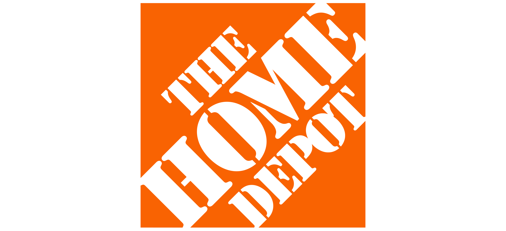

# FTC Color Guide

  

Often touted as 'The Most Famous Dinnerware in the World', Fiesta dinnerware has been a fan-favorite and an American icon since its introduction at the annual Pottery and Glass Exhibit in Pittsburgh during January of 1936. Designed in the bold Art Deco styling by Frederick Hurten Rhead, Fiesta dinnerware encourages you to mix and match for the perfect tablescape with their variety of colors.

This is an Unofficial Color Guide for Fiesta Dinnerware Colors from the beginning in 1936 to today, includes original and post 86 colors.  Uses publicly available resources, pictures, and online bloggers (linked below). 

    *This project is not endorsed or supported by The Fiesta Tableware Company. 

## Get Involved

This project is a hobby of mine, I've worked at The Fiesta Tableware Company (formerly Homer Laughlin) since 2014 in a variety of capacities. My father worked here before me since the 90's, and my mother was an employee of Hall China for a period of time. The release of the new colors every year has been something I've enjoyed both from the outside as a customer and fan, to now behind the scenes as Digital Marketing and Software Development takes me right into the mix of information/planning and release. 

Though I am an employee at The Fiesta Tableware Company, this project is not affiliated with or endorsed by them in any way.  I have been super careful not to accidentally release information about the new color every year, and have done a great deal of research to build this.  

If you love this project and want to help out - feel free to submit a Pull Request or send me a message on new features you'd like to see.

 <a href="https://github.com/TheKicker/FTC-Colors">FTC Colors repo on Github</a>

 <a href="https://cavlemasters.com/contact">Feature Request or Feedback</a>

If you'd like to support me and this project, consider <a href="https://www.buymeacoffee.com/cavlemasters">Buying Me a Coffee</a>!

 

## Why Fiesta?

<strong>Made in the USA</strong>

The Fiesta Tableware Company boasts a storied history dating back to 1871, proudly upholding the tradition of crafting quality tableware on American soil. With a heritage deeply rooted in the USA, the company has consistently delivered fine craftsmanship and enduring design since its inception. For over 150 years, The Fiesta Tableware Company has been a beacon of American manufacturing excellence, standing as a testament to the enduring legacy of producing quality tableware made with pride in the United States.

<strong>5 Year Limited Warranty </strong>

The Fiesta Tableware Company stands behind the quality and durability of its products with a robust 5 Year Limited Warranty. This warranty underscores the company's commitment to customer satisfaction, ensuring that Fiesta® products are free from defects in material and workmanship for a period of five years from the date of purchase. Customers can have confidence in their purchase, knowing that The Fiesta Tableware Company is dedicated to providing reliable and enduring tableware, backed by a comprehensive warranty that reflects their commitment to excellence.

<strong>Microwave Safe </strong>

Fiesta Tableware Company takes pride in offering microwave-safe products, allowing customers to enjoy the convenience of reheating and preparing meals with ease. From the date of reintroduction in 1986, Fiesta® dinnerware has been meticulously crafted to be microwave safe, ensuring a seamless transition from the fridge to the microwave for quick and efficient heating. With a steadfast commitment to both innovation and safety, Fiesta® products stand as a reliable choice for those seeking kitchenware that effortlessly combines style and functionality while adhering to the highest standards of microwave safety.

<strong>Oven Safe </strong>

The Fiesta Tableware Company exemplifies culinary versatility by crafting oven-safe products that elevate the cooking experience. Since its reintroduction in 1986, Fiesta® dinnerware has been designed to withstand the rigors of conventional ovens, allowing enthusiasts to seamlessly transition from preparation to baking, roasting, or broiling. This commitment to oven safety not only enhances the functionality of Fiesta® products but also underscores the company's dedication to providing kitchenware that empowers users to explore a myriad of culinary possibilities with confidence.

<strong>Dishwasher Safe </strong>

Emphasizing practicality and ease of use, the Fiesta Tableware Company ensures that its products are dishwasher safe, simplifying post-meal cleanup for busy households. The dishwasher-safe feature, a hallmark of Fiesta® dinnerware since 1986, reflects the company's commitment to convenience. With the ability to effortlessly transition from table to dishwasher, Fiesta® products not only add vibrancy to the dining experience but also streamline the maintenance of these vibrant and durable pieces.

<strong>Lead Safe </strong>

The Fiesta Tableware Company, since the reintroduction of Fiesta® dinnerware in 1986, emphasizes the absence of lead-containing raw materials in their manufacturing process. They adhere to strict standards, with all raw materials meeting California Proposition 65 settlement requirements, ensuring lead leachability below 0.002 ppm for all Fiesta® colors. The company transparently acknowledges trace amounts of lead in raw materials but asserts that any claim of 100% lead-free ceramic dinnerware is misleading.

 

## Company Links 

<a href="https://fiestatableware.com">The Fiesta Tableware Company site</a>

<a href="https://fiestafactorydirect.com">Fiesta Factory Direct retail site</a>

<a href="https://usadinnerwaredirect.com">USA Dinnerware Direct retail site</a>

 

## Knowledge Resources

<a href="https://www.post86referenceguide.com/home/colortimeline/">Post86 Reference Guide</a>

<a href="https://www.texascooking.com/fiestaware/">Texas Cooking</a>

<a href="https://en.wikipedia.org/wiki/Fiesta_(dinnerware)">Wikipedia </a>

<a href="https://www.ftcco.org/">Fiesta Tableware Company Collectors Organization</a>

<a href="https://www.hlcca.org/">Homer Laughlin China Collectors Association</a>

<a href="https://fiestadocumentary.com/links.html">DISHES: Fiesta Documentary</a>

<a href="https://www.reddit.com/r/Fiestaware/">Reddit (Unofficial)</a>

 

## Fiesta Books

<a href="https://www.amazon.com/exec/obidos/ASIN/1574322125">Collector's Encyclopedia of Fiesta</a>

<a href="http://www.amazon.com/exec/obidos/ASIN/0891455353">The Collector's Encyclopedia of Homer Laughlin China</a>

<a href="https://www.amazon.com/exec/obidos/ASIN/0740714449">Fiesta Ware - A Little Collectible Book</a>

<a href="https://www.amazon.com/exec/obidos/ASIN/1574322036">Post 86 Fiesta: Identification and Value Guide</a>

 

## Retail Partners

 

 

 

