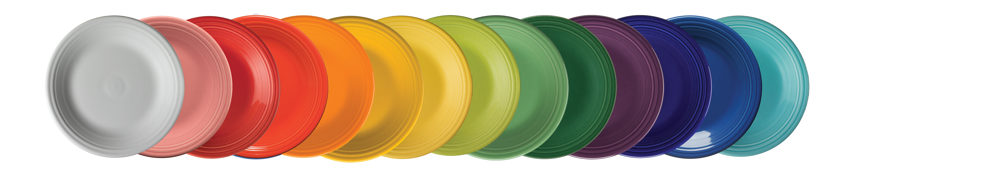

# The Unofficial Fiesta Color Guide



**[fiesta-color-guide.com](https://fiesta-color-guide.com)**

Every Fiesta® dinnerware color from 1936 to today — 61 glazes with color numbers,
production years, photographs of the fired ware, and table-setting combinations built only
from colors Fiesta actually made. Static HTML, no framework, no tracking beyond Google
Analytics.

> This project is not affiliated with, endorsed by, or sponsored by The Fiesta Tableware
> Company. Fiesta® is a registered trademark of The Fiesta Tableware Company.

---

## Adding a color (the only thing most changes need)

1. Add an entry to the `colors` array in **[`fiesta.json`](fiesta.json)**.
2. Drop the product photo in `assets/colors/`.
3. Run `npm run images` (generates the WebP thumbnail and the social card).
4. Run `npm test`.

Nothing else. That one entry produces a new color page, a new band in the ribbon,
a card in the grid, an entry in the right shade and era hubs, five pairing
combinations, a sitemap URL with its image, and updated counts in every heading
and stat that mentions one. Retiring a color is a one-field edit to `prodEnd`.
Nothing about a color is written down twice anywhere in the templates.

That's it. Push it and the GitHub Action rebuilds every page, the sitemap and the
structured data. You can even edit `fiesta.json` in the GitHub web UI and let CI do the rest.

```json
{
  "color": "Lavender",
  "description": "Meet Lavender, Fiesta's new color for 2026...",
  "sku": "351",
  "hex": "#9694B8",
  "hsv": "hsv(243, 20%, 72%)",
  "produced": "2026-current",
  "prodStart": 2026,
  "prodEnd": "current",
  "shadeOf": "Purple",
  "image": "0351.png"
}
```

`hex` is the only color value you need to get right. Every other number the site shows —
RGB, HSL, HSV, CMYK, CIELAB, LCh, WCAG contrast, and the ΔE color matches — is calculated
from it at build time, so nothing can drift out of sync.

---

## How the site is built

```
fiesta.json ──┐                  index.html, history.html, about.html, privacy.html, 404.html
              ├──> build.mjs ──> colors/<slug>/index.html          × 61   one per color
site.config ──┘                  colors/shade/<shade>/index.html   ×  9   "Fiesta blue colors"
                                 colors/era/<era>/index.html       ×  3   vintage / post-86 / in-production
                                 sitemap.xml (+ image sitemap), robots.txt, site.webmanifest
```

78 pages, 77 in the sitemap. The shade and era hubs exist because `?shade=blue`
is a query parameter a search engine will never rank — a facet worth ranking for
needs a real URL with its own title, copy and breadcrumb.

**Do not edit the generated `.html` files** — the next build overwrites them. Edit the
templates in `src/` instead.

| Path | What it is |
| --- | --- |
| `fiesta.json` | The dataset. Colors, production years, company timeline. Source of truth. |
| `site.config.json` | Base URL, analytics ID, AdSense settings. |
| `build.mjs` | The generator. Zero dependencies. |
| `src/lib/color.mjs` | Color conversion and CIEDE2000. |
| `src/lib/palettes.mjs` | The table-setting combination engine. |
| `src/lib/data.mjs` | Turns `fiesta.json` into the model templates render. |
| `src/templates/` | Page shell, components, and one function per page type. |
| `assets/css/main.css` | The whole design system. No framework. |
| `assets/js/app.js` | Progressive enhancement only — theming, filters, copy buttons. |
| `tools/` | Tests, output checks, image optimizer. |
| `.lastmod.json` | Per-page content hashes. Keeps `<lastmod>` honest — commit it. |

### Commands

```bash
npm run build     # generate every page
npm run check     # dead links, alt text, headings, JSON-LD, sitemap
npm run test:color # color math + fiesta.json integrity
npm test          # all three
npm run images    # regenerate assets/opt/ WebP derivatives (needs Python + Pillow)
npm run serve     # build, then serve at localhost:8080
```

`npm test` runs in CI on every push and blocks a broken build. Among other things
`check` fails if a page headline states a color count that `fiesta.json` no longer
supports — the one class of copy that can silently go stale.

---

## Design principles

**Static first.** Every color, description and link is in the HTML the server sends.
JavaScript adds filtering, sorting, theming and copy buttons on top. With JS off the site
is still a complete, readable, crawlable guide — which is also why search engines index it
on the first pass instead of waiting for a render queue.

**The hex is the source of truth, not the headline.** A color page leads with the number a
collector reads off the back of a plate and the colors it pairs with; the hex is a caption.
But everything derived — CIELAB, the ΔE rankings, the pairing logic, the black-or-white
swatch labels — still comes from that one value, so nothing can drift.

**Pairings say where they come from.** The first combination on a color page, where one
exists, is the pairing named in that color's own description in `fiesta.json` — a person
wrote it, so it outranks a formula, and it is labelled as such. The rest each state their
rule (opposite hues, tonal ladder, neutral anchor…). Colors closer than ΔE 12 are never put
in the same set, and neutrality is judged by LCh chroma rather than HSL saturation, which
badly misjudges very light and very dark colors.

**Say what we don't know.** Fiesta doesn't publish hex values for its glazes, and a fired
ceramic finish varies by production run, glaze thickness, lighting and your display. The
site says so, on every color page, rather than implying a precision it doesn't have.

**Accessibility is a feature, not a checklist.** Targets WCAG 2.2 AA:

- Color is never the only carrier of information — every swatch has its name and hex as text.
- Swatch labels use black or white chosen per-color by WCAG contrast ratio.
- Every band in the color ribbon is a real link with a real accessible name, plus a skip link
  past all 61 of them.
- All filters work by keyboard; `role="status"` announces result counts without spamming.
- Light and dark themes both meet AA, follow the system setting, and respect an explicit choice.
- Motion respects `prefers-reduced-motion`.
- `npm run check` fails the build on a missing `alt`, an unlabelled control, a skipped heading
  level or a dead link.

**Fast, because it's small.** No Bootstrap, no jQuery, no icon font, no webfont. One
stylesheet, one script, SVG icons inline. Images ship as WebP with original fallbacks —
the source images were 10.7 MB and are now 0.31 MB.

**`<lastmod>` means something.** Every page's content is hashed into `.lastmod.json`, and
its sitemap date only advances when that hash moves. Stamping all 77 URLs with the build
date on every run is noise a crawler learns to ignore.

**Responsive down to 320px.** No fixed-width anything; every auto-fill grid track is
guarded with `minmax(min(100%, …), 1fr)` and `npm run check` warns if one isn't. Below
768px the 61-band color ribbon becomes a grid of ~45px tappable squares, because at phone
width each band would otherwise be about 4px wide — well under the 24px WCAG 2.2 SC 2.5.8
asks for.

---

## The domain

The site is canonical at **https://fiesta-color-guide.com**. Two files decide that:

| File | Role |
| --- | --- |
| `site.config.json` &rarr; `baseUrl` | The canonical origin. Every canonical tag, Open Graph URL, sitemap entry, schema `@id` and the `Sitemap:` line in `robots.txt` is built from it. |
| `CNAME` | What GitHub Pages serves the site as. Must match `baseUrl`'s host. |

All internal links are relative, so the site works from a domain root or a project subpath
without changes. `npm run check` fails if any absolute URL points at a `github.io` host, so a
half-finished domain move can't ship.

### DNS

For an apex domain on GitHub Pages, point `fiesta-color-guide.com` at GitHub's Pages IPs with
four `A` records and four `AAAA` records, and add a `CNAME` record for `www` pointing at
`thekicker.github.io`. **Take the current IP addresses from
[GitHub's own docs](https://docs.github.com/pages/configuring-a-custom-domain-for-your-github-pages-site/managing-a-custom-domain-for-your-github-pages-site)**
rather than from any tutorial — they have changed before.

Then in the repository: **Settings &rarr; Pages &rarr; Custom domain**, enter the domain, and
tick **Enforce HTTPS** once the certificate is issued (it can take up to an hour).

Because `CNAME` holds the apex, GitHub redirects `www` to the apex automatically, so there is
one canonical host rather than two competing for the same pages.

### What does not move by itself

GitHub Pages 301-redirects `thekicker.github.io/Fiesta-Color-Guide/*` to the custom domain
once the domain is set, so existing links and any accumulated ranking follow. Three things
are manual:

- **Search Console** — the token in `site.config.json` belongs to the old property and will
  not verify the new domain. Add `fiesta-color-guide.com` as a property, ideally verifying by
  DNS TXT record (it covers every subdomain and survives template changes), then submit
  `https://fiesta-color-guide.com/sitemap.xml`.
- **Google Analytics** — the measurement ID keeps working, but update the data stream's URL in
  the GA4 admin so reports and referral exclusions are right.
- **AdSense** — add the site as `fiesta-color-guide.com`. This is also the fix for the
  `ads.txt` problem: it now serves from the domain root, which is where AdSense looks for it.

## AdSense

Two independent stages, both driven by `site.config.json`.

**Stage 1 — verification and Auto ads.** Setting `client` puts the `google-adsense-account`
meta tag and the AdSense loader script in the `<head>` of *every* page, and writes a matching
`ads.txt`. That is everything Google needs to review the site, and everything Auto ads needs
once approved:

```json
"adsense": { "client": "ca-pub-XXXXXXXXXXXXXXXX", "slots": { "leaderboard": "", "rectangle": "" } }
```

**Stage 2 — manual placements.** After approval, create ad units in AdSense and paste their
slot IDs into `slots`. Each filled slot renders an `<ins>` unit in a box whose height is
already reserved, so an ad can never shift the layout as it loads. An empty slot emits
nothing at all — a page under review should not contain empty ad containers.

To turn everything off, clear `client`.

`npm run check` fails if any page is missing either tag or has them outside `<head>`, so a
template change can't silently break verification. A [privacy policy](privacy.html) covering
advertising cookies is published and linked from every page, which AdSense requires.

`ads.txt` is generated at the site root, which on `fiesta-color-guide.com` is exactly where
AdSense looks for it. Add the site to AdSense under the custom domain, not the old
`github.io` address.

---

## Get involved

This project is a hobby of mine and closely tied to my history with The Fiesta Tableware
Company (formerly Homer Laughlin), where I worked from June 2014 to March 2024 in a variety
of roles. It's very much a family affair — my father spent 25 years there, my mother worked
at Hall China for five years, and many friends and relatives have worked within these
companies as well. Fiesta is a true staple of our community and one we hold in deep
admiration.

Though I am a previous employee, this project is not affiliated with or endorsed by them in
any way. I have been careful not to release information about the new color before it is
announced, and have done a great deal of research to build this project.

Corrections are genuinely welcome — dates in particular. [Open an issue](https://github.com/TheKicker/Fiesta-Color-Guide/issues/new)
or send a pull request.

- [Feature request or feedback](https://cavlemasters.com/contact)
- [Buy me a coffee](https://www.buymeacoffee.com/cavlemasters)

---

## Why Fiesta?

**Made in the USA.** The Fiesta Tableware Company's history dates back to 1871, upholding
the tradition of crafting quality tableware on American soil for over 150 years.

**5-year limited warranty.** Fiesta® products are warranted free from defects in material
and workmanship for five years from the date of purchase.

**Microwave, oven and dishwasher safe.** Since the 1986 reintroduction, Fiesta® dinnerware
has been made to move from fridge to microwave to oven (to 350°F) to dishwasher.

**Lead safe.** Since 1986 no lead-containing raw materials are used. All raw materials meet
California Proposition 65 settlement requirements, with lead leachability below 0.002 ppm
for all Fiesta® colors. The company notes trace amounts of lead exist in raw materials and
that any claim of 100% lead-free ceramic dinnerware is misleading.

---

## Company links

[The Fiesta Tableware Company](https://fiestatableware.com) ·
[Fiesta Factory Direct](https://fiestafactorydirect.com) ·
[USA Dinnerware Direct](https://usadinnerwaredirect.com)

[Facebook](https://www.facebook.com/fiestatablewarecompany/) ·
[Instagram](https://www.instagram.com/fiestadinnerware/) ·
[Pinterest](https://www.pinterest.com/fiestadishes/) ·
[TikTok](https://www.tiktok.com/@fiestadinnerware) ·
[YouTube](https://www.youtube.com/user/HLCHINA) ·
[X/Twitter](https://twitter.com/FiestaOutlets)

## Knowledge resources

[Post86 Reference Guide](https://www.post86referenceguide.com/home/colortimeline/) ·
[Texas Cooking](https://www.texascooking.com/fiestaware/) ·
[Wikipedia](https://en.wikipedia.org/wiki/Fiesta_(dinnerware)) ·
[Fiesta Tableware Company Collectors Organization](https://www.ftcco.org/) ·
[Homer Laughlin China Collectors Association](https://www.hlcca.org/) ·
[DISHES: Fiesta Documentary](https://fiestadocumentary.com/links.html) ·
[r/Fiestaware](https://www.reddit.com/r/Fiestaware/)

## Fiesta books

[Collector's Encyclopedia of Fiesta](https://www.amazon.com/exec/obidos/ASIN/1574322125) ·
[The Collector's Encyclopedia of Homer Laughlin China](http://www.amazon.com/exec/obidos/ASIN/0891455353) ·
[Fiesta Ware — A Little Collectible Book](https://www.amazon.com/exec/obidos/ASIN/0740714449) ·
[Post 86 Fiesta: Identification and Value Guide](https://www.amazon.com/exec/obidos/ASIN/1574322036)

## Retail partners

[Wayfair](https://www.wayfair.com/brand/bnd/fiesta-b1200.html) ·
[Everything Kitchens](https://www.everythingkitchens.com/fiestaware.html) ·
[Macy's](https://www.macys.com/shop/dining-entertaining/fiesta/Special_offers/Sales%20%26%20Discounts?id=28954) ·
[Walmart](https://www.walmart.com/brand/fiesta/10007290) ·
[Belk](https://www.belk.com/br/fiesta/?brand=Fiesta%C2%AE) ·
[Home Depot](https://www.homedepot.com/s/Fiesta?NCNI-5) ·
[Replacements](https://www.replacements.com/fiesta) ·
[Zola](https://www.zola.com/shop/brand/fiesta) ·
[Dillard's](https://www.dillards.com/brand/Fiesta/home)

---

## Using the data

[`fiesta.json`](fiesta.json) is CC0-ish in spirit — take it, a link back is appreciated.
Colors, production years, shade families, descriptions and the company timeline all live
there. Code is MIT. Product photographs and the Fiesta® name belong to The Fiesta Tableware
Company and are used here for identification and reference only.
