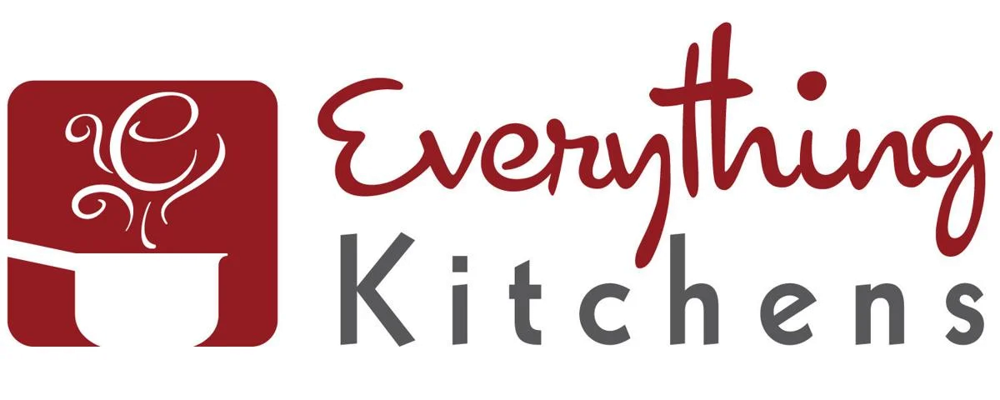

# FTC Color Guide

  

Often touted as 'The Most Famous Dinnerware in the World', Fiesta dinnerware has been a fan-favorite and an American icon since its introduction at the annual Pottery and Glass Exhibit in Pittsburgh during January of 1936. Designed in the bold Art Deco styling by Frederick Hurten Rhead, Fiesta dinnerware encourages you to mix and match for the perfect tablescape with their variety of colors.

This is an Unofficial Color Guide for Fiesta Dinnerware Colors from the beginning in 1936 to today, includes original and post 86 colors.  Uses publicly available resources, pictures, and online bloggers (linked below). 

    *This project is not endorsed or supported by The Fiesta Tableware Company. 

 

## Company Links 

<a href="https://fiestatableware.com">The Fiesta Tableware Company site</a>

<a href="https://fiestafactorydirect.com">Fiesta Factory Direct retail site</a>

<a href="https://usadinnerwaredirect.com">USA Dinnerware Direct retail site</a>

## Knowledge Resources

<a href="https://www.post86referenceguide.com/home/colortimeline/">Post86 Reference Guide</a>

<a href="https://www.texascooking.com/fiestaware/">Texas Cooking</a>

<a href="https://en.wikipedia.org/wiki/Fiesta_(dinnerware)">Wikipedia </a>

## Retail Partners

